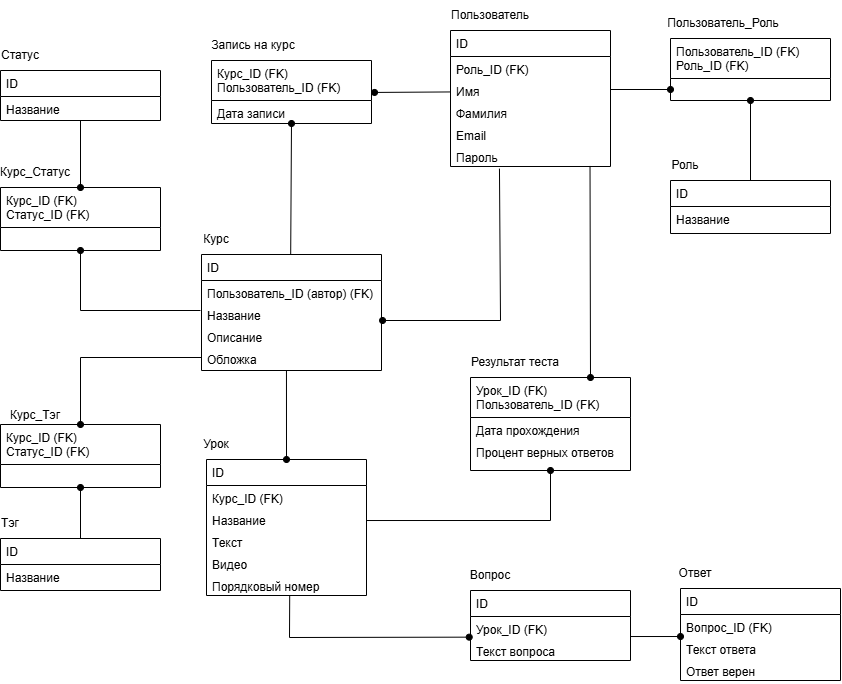

# Веб-приложение для создания и прохождения обучающих курсов

## Функционал для авторов курсов

- Создание нового курса:
  - Название, описание
  - Тэги
  - Уроки (тоерия+практика)
- Добавление теоретического материала в текстовом или в видео формате
- Создание тестовых заданий
- Управление списком участников курса
---

## Функционал для обучающихся

- Просмотр каталога доступных курсов (с фильтрами и поиском):
- Запись на курс
- Прохождение курса:
  - Просмотр теоретических материалов
  - Выполнение практических заданий
- Отслеживание личного прогресса

---

## Общие возможности

- Регистрация, аутентификация

## Схема базы данных

